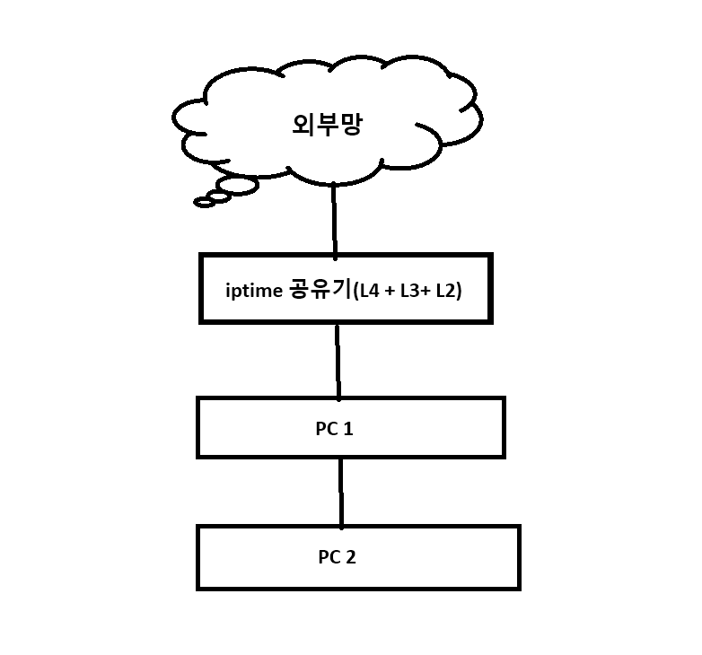

# usermode-L2-L3-firewall

usermode-L2-L3-firewall (Advanced version)

# 이전 버전과 차이점
PC1과 PC2의 IPv4 주소 대역이 상이해도 동작 가능

# 구조

```

       [ 외부망 ] 
           ▲
           | (공인 IP → NAT 변환) 
       [ 인터넷 공유기 ]  
           |     IP : 192.168.0.1
           |     MAC: G1:G1:G1:G1:G1:G1
           |                
           │
           │
      [ PC1의 두번째 NIC ] IP: 192.168.0.3
           │            MAC: A1:A1:A1:A1:A1:A1
           │    
           │ (유저모드에서 인터페이스 전환 및 패킷 릴레이)
           │ 
           │
      [ PC1의 첫번째 NIC ]  IP: 10.10.10.99
           │             MAC: B1:B1:B1:B1:B1:B1
           │
      [ 랜선 다이렉트 연결 ]
           │
           ▼
    [ PC2의 NIC ]
    IP: 10.10.10.111
    MAC: C1:C1:C1:C1:C1:C1
    
```
# 구조도



# 원리

```

[1] PC2 브라우저 요청
    Src IP: 10.10.10.111 (PC2의 NIC)
    Dst IP: 8.8.8.8 (외부 서버 IP)
    Src MAC: C1:C1:C1:C1:C1:C1 (PC2의 NIC)
    Dst MAC: B1:B1:B1:B1:B1:B1 (PC1의 첫번째 NIC)
    → PC2 커널이 NIC로 패킷 전달
    → PC2의 NIC가 패킷을 PC1으로 전달
          
[2] PC1의 커널의 TCP/IP 스택 우회 후 PC1의 유저 모드에서 패킷 캡쳐 (pcap 수신)   
    → MAC 및 IP 주소 수정
      Src MAC: A1:A1:A1:A1:A1:A1 (PC1의 두번째 NIC)
      Dst MAC: G1:G1:G1:G1:G1:G1 (공유기 MAC)
      Src IP : 192.168.0.111 (Fake IP == ARP Spoofing IP)
    → 공유기로 전송 (인터페이스 전환 & pcap 송신)

[3] 공유기
    NAT 기록 생성
    Src IP: 공인 IP로 변경 후 외부 서버로 요청

[4] 공유기에 외부 서버 응답 도착
    Src IP: 8.8.8.8 (외부 서버 IP)
    Dst IP: 192.168.0.111 (Fake IP == ARP Spoofing IP)
    Src MAC: G1:G1:G1:G1:G1:G1 (공유기 MAC)
    Dst MAC: A1:A1:A1:A1:A1:A1 (PC1의 두번째 NIC)

[5] PC1의 커널의 TCP/IP 스택 우회 후 PC1의 유저 모드에서 패킷 캡쳐 (pcap 수신)) 
    → MAC 및 IP 주소 수정
    Src MAC: B1:B1:B1:B1:B1:B1 (PC1의 첫번째 NIC)
    Dst MAC: C1:C1:C1:C1:C1:C1 (PC2의 NIC)
    Dst IP: 10.10.10.111 (PC2의 NIC)
    → PC2에게 유선으로 전달 (인터페이스 전환 & pcap 송신)

[6] PC2의 커널이 수신
    [1]에서 PC2 커널이 보낸 패킷에 대한 응답을 다시 PC2 커널이 수신
    IP/Port 정보 일치 → 응답 처리 → PC2에서 인터넷 되는 것처럼 동작

[*] 핵심 기술
    → 공유기에 연결되어 있지 않은
    192.168.0.111을 연결이 되어있는 것 처럼 속이기 위해
    192.168.0.1에 ARP 패킷을 지속적으로 보내서 게이트웨이의 ARP 테이블을 조작
    → 패킷의 IP 변경으로 인한 IP & TCP 체크섬 수정 (악용의 소지가 있어 코드 비공개)
```

# PC1 (외부 인터넷과 연결된 PC)


# PC2 (외부 인터넷과 단절된 PC)


