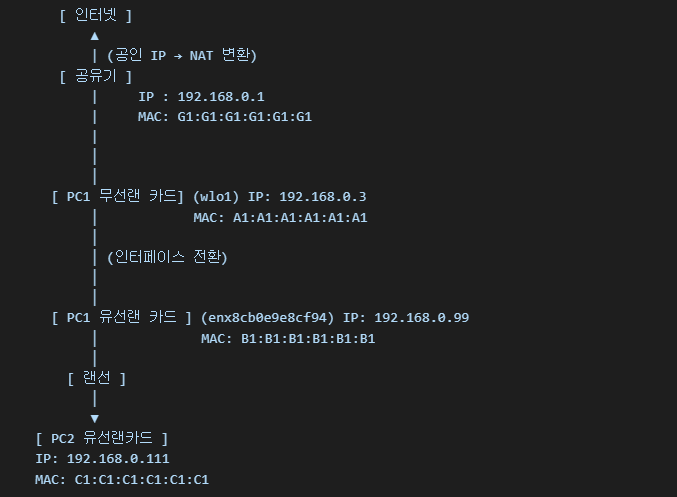

# usermode-L2-L3-firewall

usermode-L2-L3-firewall

# 구조



# 원리

```
[1] PC2 브라우저 요청
    Src IP: 192.168.0.111
    Dst IP: 8.8.8.8
    Src MAC: C1
    Dst MAC: B1 → 전달

[2] PC1 유저모드 (pcap 수신)
    → MAC 주소 수정
      Src MAC: A1
      Dst MAC: 공유기 MAC (G1)
    → 공유기로 전송

[3] 공유기
    NAT 기록 생성
    Src IP: 공인 IP로 변경 후 외부 서버로 요청

[4] 외부 응답 도착
    Src IP: 외부 서버 IP
    Dst IP: 192.168.0.111
    Src MAC: 공유기 MAC (G1)
    Dst MAC: A1

[5] PC1 유저모드 (pcap 수신)
    → MAC 주소 수정
      Src MAC: B1
      Dst MAC: C1
    → PC2 유선으로 전달

[6] PC2 커널 수신
    IP/Port 정보 일치 → 응답 처리 → 인터넷 되는 것처럼 동작

[*] 공유기에 연결되어 있지도 않은
    192.168.0.111을 연결되어있는 것 처럼 속이기 위해
    192.168.0.1에 ARP 패킷을 지속적으로 보내서 ARP 테이블을 조작

```

# PC1 (외부 인터넷과 연결된 PC)


# PC2 (외부 인터넷과 단절된 PC)


